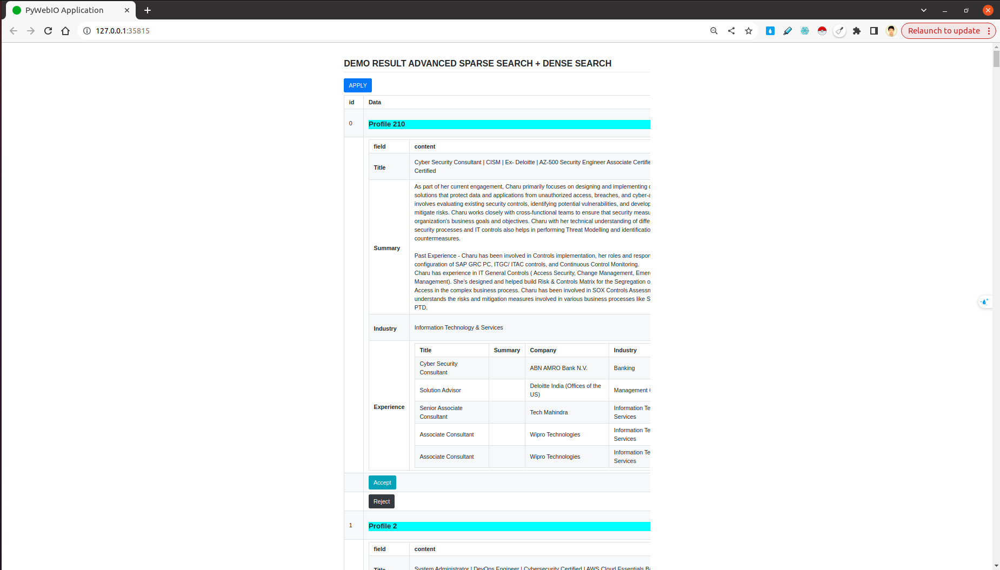

# Recruitment Recommendation System

Author: duongkstn

## Problem Statement
Given profiles, each time user click accept/reject, the system must re-rank the result.
The format of each profile as follow:
```json
{
    "title": "",
    "summary": "",
    "industry":  "",
    "experience": [{
        "job-title": "",
        "job-summary": "",
        "job-company": "",
        "job-industry": ""
    }]
}
```

## Methodologies:

### 1. Advanced sparse search (Fast, Less Accurate, Stable)
Indexing profile into Elasticsearch, using boost score for each field. In more details:
boost score of `title` is `100`, of `industry` is `50`, of `summary` is `3` and of `experience` is `1`.

### 2. Advanced sparse search and few-shot dense learning (Slow, Accurate, Unstable)
Using output from method 1. In more details, I consider the first `4` elements are positive, the last `4` elements are negative. Using 8 samples, I can train a dense model.
Model architecture: `intfloat/e5-large` (maximum length = 512, embedding size = 1024).

Checkout this repos: https://github.com/huggingface/setfit


## Installation:

### 1. Install elasticsearch, redis-server

https://www.elastic.co/guide/en/elasticsearch/reference/current/install-elasticsearch.html

https://redis.io/docs/install/install-redis/

### 2. Install requirements
`pip install -r requirements.txt`

### 3. Demo
#### 3a. Method 1
- Start elasticsearch server
- Run `python sparse.py`, it will open a web browser
#### 3b. Method 2 (Must have GPUs)
- Start elasticsearch server
- Start redis server
- Run `setfit_service.py`
- Run `python sparse_setfit.py`, it will open a web browser




